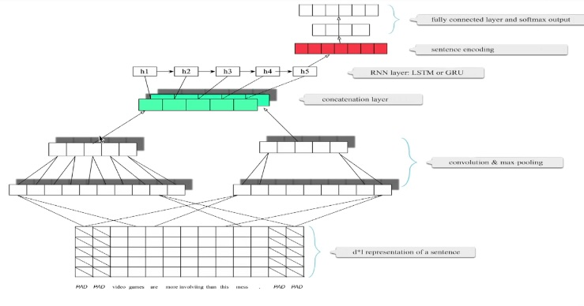
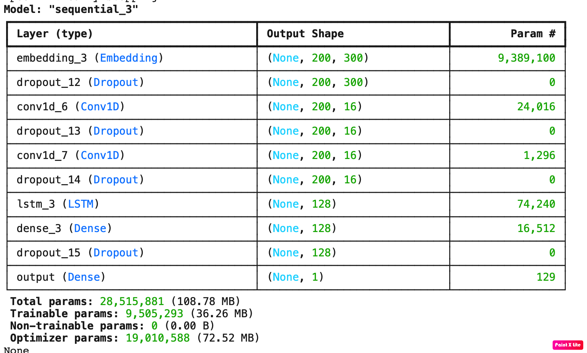

# Stock price prediction

## Motivation

A stock market index is significantly influenced by the news headlines that appear daily on television and newspapers, along with various other factors. Highly negative news impacts the stock market adversely, while positive news has a favorable effect. This observation inspires the design and development of a deep learning neural network that analyzes news headlines and predicts next-day stock prices for a specific market.

This project aims to model the relationship between news headlines and the stock market price of an index. The assumption is that news headlines from a particular day influence the opening stock price of an index on the following day.

## Table of Contents

- [System Overview](#system_overview)
- [Dataset Prepration](#general-information)
- [Model Architecture](#model-architecture)
- [Model Building](#model-architecture)
- [Model Summary](#model-summary)
- [Model Evaluation](#model-evaluation)
- [Technologies Used](#technologies-used)
- [Collaborators](#collaborators)

<!-- You can include any other section that is pertinent to your problem -->

## System Overview

The image above represents a high-level overview of the stock market prediction system. Users input news headlines for a particular day. These sentences are then converted to word embeddings and fed into a CNN. The CNN extracts features from these sentences, and the concatenated sequences are passed on to an RNN to learn the sentence sequences for that day. Finally, the sentence embeddings are passed to a fully connected layer to output the stock market opening price.

All these steps are implemented in the notebook attached to the project. You can open it in Google Colab to run, build the model, and start predicting stock market prices. Note that the dataset used for this training is historical. To build a model relevant to a particular market and current date, you will need to prepare the dataset accordingly.

## Dataset Prepration

The primary challenge in building a deep learning model is sourcing specific datasets for a given problem and curating accurate data.

For this project, datasets from Kaggle, specifically Dow Jones stock prices and Reddit news headlines, have been utilized. The dataset contains historical data from 2008 to 2016. The stock prices and relevant news of each day are combined to form one dataset to feed into the network.

Here’s an example of a data point for a particular day from the datasets:

News from 2016-07-01 in the news dataset:

Dow Jones Stock Market Index as of 2016-07-01 from the Dow Jones dataset:

`Date,Open,High,Low,Close,Volume,Adj Close`

 `2016-07-01,17924.240234,18002.380859,17916.910156,17949.369141,82160000,17949.369141`

These two datasets need to be combined using the date column to make one single dataset for training. The stock market opening price is used as the label, while news from the previous day is used as the feature set to train the model. Once trained, the model can predict the stock market opening price using news from a particular day. This process is illustrated in the diagram below:

## Model Architecture

### The CNN-RNN architecture

This architecture combines Convolutional 1D and Recurrent Neural Networks. 1D CNN extracts meaningful features, resulting in shorter sequences processed more efficiently. These vectors are then fed into an RNN in the same manner as feeding a sentence.

As shown in the architecture, multiple convolutional layers are applied in parallel to the 'feature representation' of the text. The feature representation is generated using GloVe vector embeddings. The outputs of the multiple convolutional layers are concatenated, and the RNN layer works on top of this.

A fully connected layer sits on top of the RNN. Since this is a regression problem, there is no activation function to bound the output.

The image below shows the actual model architecture, captured from the Keras sequential model summary. The model architecture can be fine-tuned with various combinations of convolutional, dropout, pooling, and RNN layers to build a better-performing model:

## Model Summary

## Model 1 Evaluation

### **Note:**  Model 4 trained with augmented data, without batch normalization and a dropout layer before flatterning, that resulted well-balanced performance, displaying no signs of underfitting or overfitting.

## Overall Observations:

- The implementation of class rebalancing has notably enhanced the model's performance across both training and validation datasets.
- The narrow divergence between training and validation accuracies underscores the robust generalization capability of the final CNN model.
- The addition of batch normalization failed to enhance both training and validation accuracy.
- Those classes have significant percentage of representation were predicted accurately and on the other hand those classes which have low representation were predicted incorrectly.
- 'basal cell carcinoma' class which has 376 representation (third highest) predicted correctly.
- 'melanoma' class which has 438 representation (second highest) predicted correctly.
- 'nevus' class which has 357 representation (fourth highest) predicted correctly.
- 'pigmented benign keratosis' class which has 462 representation (highest) predicted correctly.

## Technologies Used

- [Python](https://www.python.org/) - version 3.11.4
- [Matplotlib](https://matplotlib.org/) - version 3.7.1
- [Numpy](https://numpy.org/) - version 1.24.3
- [Pandas](https://pandas.pydata.org/) - version 1.5.3
- [Seaborn](https://seaborn.pydata.org/) - version 0.12.2
- [Tensorflow](https://www.tensorflow.org/) - version 2.15.0

## Collaborators

Created by [@davisvarkey](https://github.com/davisvarkey)
