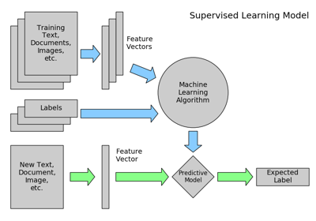
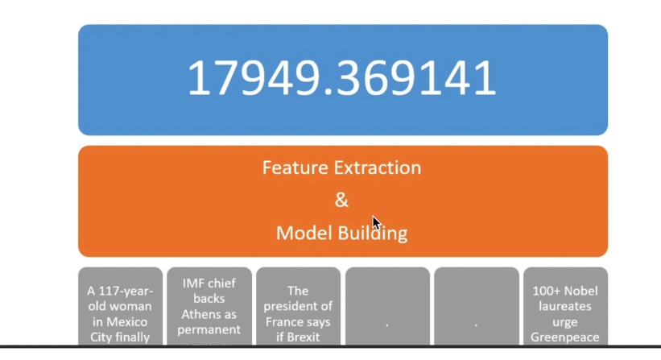

# Stock price prediction

## Motivation

A stock market index gets affected by the news headlines that run daily on television and newspapers along with a multitude of other factors. Highly negative news impacts the stock market negatively and positive news impacts the stock market positively. This observation inspires to design and build a deep learning neural network which analyze news headlines and predict next-day stock prices for a specific market.
 
Here, we'll try to model this relationship between the news and the stock market price of an index. Our assumption in modelling the stock price in this exercise is that news headlines that run on a particular day affect the opening stock price of an index the very next morning.

## Table of Contents

- [Dataset Prepration](#general-information)
- [Model Architecture](#model-architecture)
- [Model Building](#model-architecture)
- [Model Summary](#model-summary)
- [Model Evaluation](#model-evaluation)
- [Technologies Used](#technologies-used)
- [Collaborators](#collaborators)

<!-- You can include any other section that is pertinent to your problem -->

## Dataset Prepration

The primary challenge of building deep learning model is sourcing specific dataset for a given problem, and curating and preparing accurate dataset.

For this project, datasets from Kaggle, specifically Dow Jones stock prices and Reddit news headlines, have been utilized. The dataset contains historical data from 2008 to 2016.  The stock prices and the relevant news of each day has to be combined to form one dataset to feed into the network.

Lets look at a datapoint for a particular day from the datasets

News as of 2016-07-01 from the News dataset is given below:

### Date,News

`2016-07-01,"A 117-year-old woman in Mexico City finally received her birth certificate, and died a few hours later. Trinidad Alvarez Lira had waited years for proof that she had been born in 1898."

2016-07-01,IMF chief backs Athens as permanent Olympic host

2016-07-01,"The president of France says if Brexit won, so can Donald Trump"`

2016-07-01,British Man Who Must Give Police 24 Hours' Notice of Sex Threatens Hunger Strike: The man is the subject of a sexual risk order despite having never been convicted of a crime.

2016-07-01,100+ Nobel laureates urge Greenpeace to stop opposing GMOs

2016-07-01,Brazil: Huge spike in number of police killings in Rio ahead of Olympics

2016-07-01,Austria's highest court annuls presidential election narrowly lost by right-wing candidate.

2016-07-01,"Facebook wins privacy case, can track any Belgian it wants: Doesn't matter if Internet users are logged into Facebook or not"

2016-07-01,"Switzerland denies Muslim girls citizenship after they refuse to swim with boys at school: The 12- and 14-year-old will no longer be considered for naturalised citizenship because they have not complied with the school curriculum, authorities in Basel said"

2016-07-01,"China kills millions of innocent meditators for their organs, report finds"

2016-07-01,"France Cracks Down on Factory Farms - A viral video campaign has moved the govt to act. In footage shared widely online, animals writhe in pain as they bleed to death or are dismembered, in violation of rules requiring they be rendered unconscious before slaughter."

2016-07-01,Abbas PLO Faction Calls Killer of 13-Year-Old American-Israeli Girl a Martyr

2016-07-01,Taiwanese warship accidentally fires missile towards China

2016-07-01,"Iran celebrates American Human Rights Week, mocks U.S. rights record"

2016-07-01,U.N. panel moves to curb bias against L.G.B.T. people despite fierce resistance from Muslim and African countries.

2016-07-01,"The United States has placed Myanmar, Uzbekistan, Sudan and Haiti on its list of worst human trafficking offenders."

2016-07-01,S&amp;P revises European Union credit rating to 'AA' from 'AA+'

2016-07-01,India gets $1 billion loan from World Bank for solar mission

2016-07-01,U.S. sailors detained by Iran spoke too much under interrogation: Navy
2016-07-01,Mass fish kill in Vietnam solved as Taiwan steelmaker accepts responsibility for pollution
2016-07-01,"Philippines president Rodrigo Duterte urges people to kill drug addicts | Duterte, 71, won power in a landslide after a campaign dominated by threats to kill tens of thousands in a war on crime"
2016-07-01,Spain arrests three Pakistanis accused of promoting militancy
2016-07-01,"Venezuela, where anger over food shortages is still mounting, continued to be roiled this week by angry protests and break-ins of grocery stores and businesses that have left five dead, at least 30 injured and 200 arrested, according to various news reports."
2016-07-01,"A Hindu temple worker has been killed by three men on a motorcycle, local police have said. More than 40 people have been killed in attacks blamed on Islamist militants in Bangladesh since February 2013, including secular bloggers, academics, gay rights activists and members of religious minorities."
2016-07-01,"Ozone layer hole seems to be healing - US &amp; UK team shows it's shrunk &amp; may slowly recover. ""If you had to have an ozone hole anywhere in the world, it'd be Antarctica because its not teeming with life. It showed us if we didnt back off with these chemicals, wed have a crisis.""" ***

DowJones Stock market index as of 2016-07-01 from DowJones dataset is given below:

### ** Date,Open,High,Low,Close,Volume,Adj Close

2016-07-01,17924.240234,18002.380859,17916.910156,17949.369141,82160000,17949.369141

These two datasets needs to be combined by date to make one single dataset for further processing.

## Model Architecture

### The CNN-RNN architecture

In this architecure, combination of Convolutional 1D and Recurrent Neural Network is used. 1D CNN to extract meaningful features which results in much shorter sequences in a much faster way. You can then feed this vector to an RNN in the same way as one would feed a sentence.

## Problem statement & Reference Architecture

- Aim: Use Reddit News Headlines to predict the movement of Dow Jones Industrial Average.

- Data Source: https://www.kaggle.com/aaron7sun/stocknews

- Data Description: Dow Jones details on Open, High, Low and Close for each day from 2008-08-08 to 2016-07-01 and headlines for those dates from Reddit News.

- Methodology: For this project, we will use GloVe to create our word embeddings and CNNs followed by LSTMs to build our model. This model is based off the work done in this paper https://www.aclweb.org/anthology/C/C16/C16-1229.pdf.

## Pictorial representation of skin types

The aim of this task is to assign a specific class label to a particular type of skin cancer.

## Model Summary

## Model 1 Evaluation

### **Note:**  Model 4 trained with augmented data, without batch normalization and a dropout layer before flatterning, that resulted well-balanced performance, displaying no signs of underfitting or overfitting.

## Overall Observations:

- The implementation of class rebalancing has notably enhanced the model's performance across both training and validation datasets.
- The narrow divergence between training and validation accuracies underscores the robust generalization capability of the final CNN model.
- The addition of batch normalization failed to enhance both training and validation accuracy.
- Those classes have significant percentage of representation were predicted accurately and on the other hand those classes which have low representation were predicted incorrectly.
- 'basal cell carcinoma' class which has 376 representation (third highest) predicted correctly.
- 'melanoma' class which has 438 representation (second highest) predicted correctly.
- 'nevus' class which has 357 representation (fourth highest) predicted correctly.
- 'pigmented benign keratosis' class which has 462 representation (highest) predicted correctly.

## Technologies Used

- [Python](https://www.python.org/) - version 3.11.4
- [Matplotlib](https://matplotlib.org/) - version 3.7.1
- [Numpy](https://numpy.org/) - version 1.24.3
- [Pandas](https://pandas.pydata.org/) - version 1.5.3
- [Seaborn](https://seaborn.pydata.org/) - version 0.12.2
- [Tensorflow](https://www.tensorflow.org/) - version 2.15.0

## Collaborators

Created by [@davisvarkey](https://github.com/davisvarkey)
